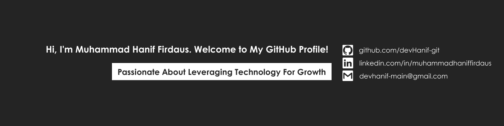

# Hello, folks! 

My name is **Muhammad Hanif Firdaus** and I'm a **IT Engineer • Freelance Designer • Store Assistance • Event Organizer**. I'm from Malaysia, living in Penang and currently working at **CG Global Profastex Manufacturing Sdn. Bhd.**, You can find me on [![LinkedIn][2.2]][2].

## 🔧 Technologies & Tools

## &#x1f4c8; GitHub Stats

<!-- links to your social media accounts -->

[1]: https://github.com/devHanif-git
[2]: https://www.linkedin.com/in/muhammadhaniffirdaus/

<!-- icons -->

[2.2]: img/linkedin15x15.png "LinkedIn Logo"

<!-- Resources -->
<!-- Icons: https://simpleicons.org/ -->
<!-- GitHub Stats: https://github.com/anuraghazra/github-readme-stats -->
<!-- Emojis: https://emojipedia.org/emoji/ -->
<!-- HTML Emojis: https://www.fileformat.info/index.htm -->
<!-- Shields: https://shields.io/ -->
<!-- Awesome GitHub Profile README: https://github.com/abhisheknaiidu/awesome-github-profile-readme -->
